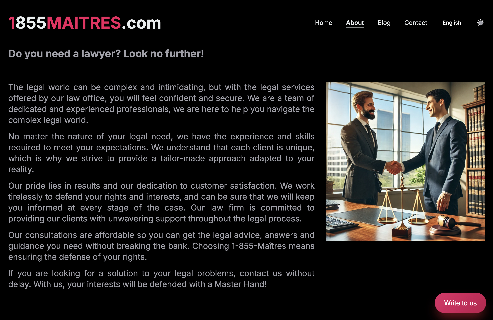
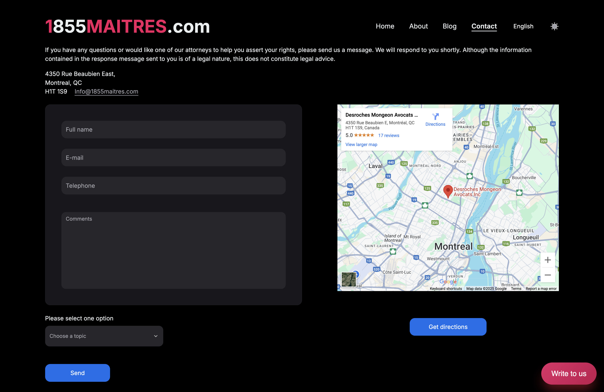

# **_1855MAITRES_**

This website is a business card for a law firm.

## Site structure

The site has a `Home page`:

An `About page` with additional information:

A `Blog page`:

And a `Contact page`:

## Additional Information

> This site is designed with a layout and additionally adapted for all
> devices.

> React, TS and Vite were used for work. The Axios library is used for queries.

> Also used were NextUI, Tailwind, Swiper and i18next.

The project is deployed on vercel.com: [1855MAITRES](https://1855maitres.vercel.app/).

[^ Up to start ^](#start)